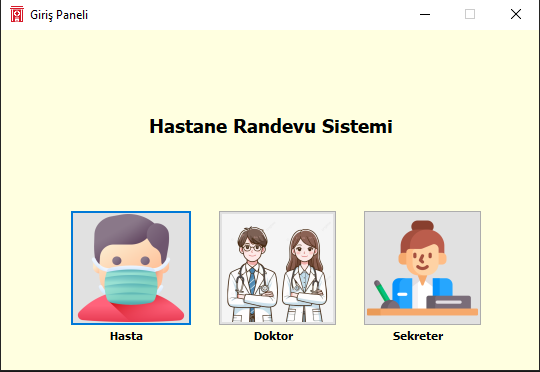
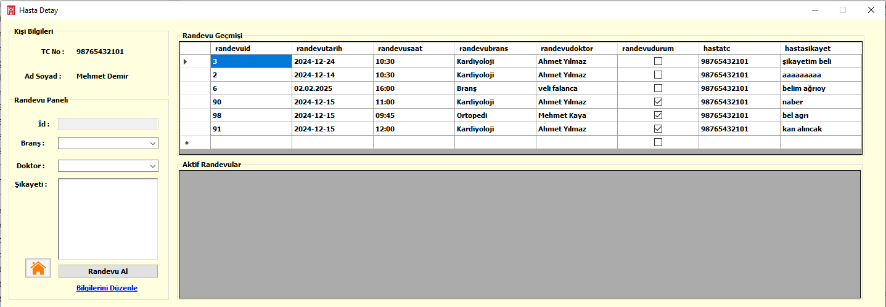
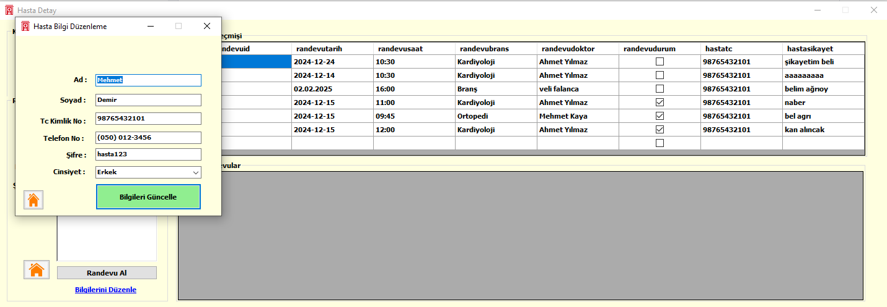
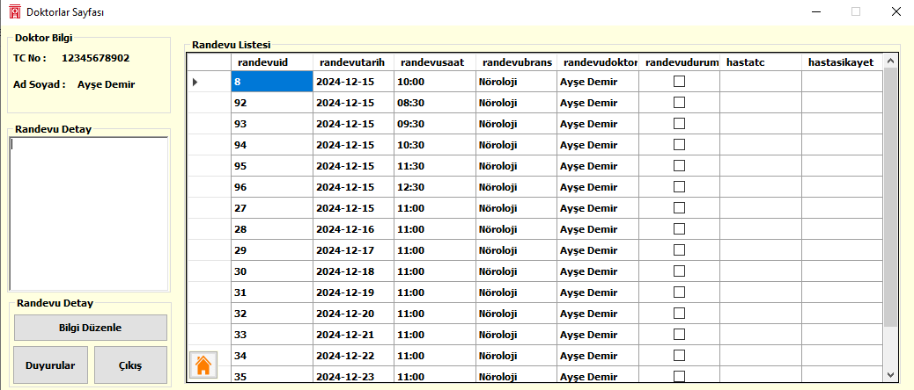
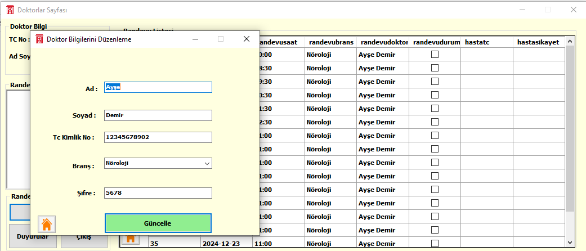
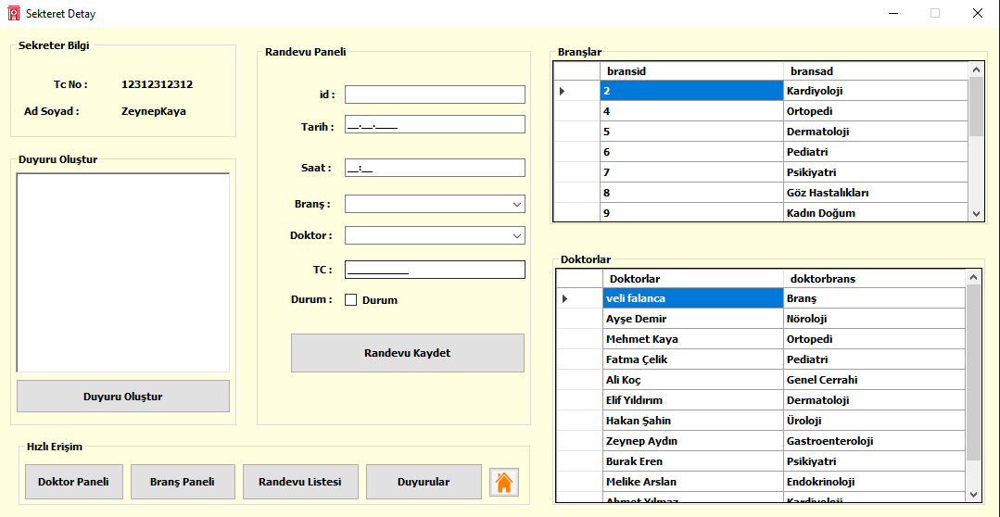

# Hastane Randevu Yönetim Otomasyonu

## Projenin Amacı
Bu proje, hastane randevu süreçlerini dijitalleştirerek hastaların, doktorların ve sekreterlerin işlemlerini kolaylaştırmayı amaçlamaktadır.

---

## 1. Ana Sayfa
- Kullanıcıların (Hasta, Doktor, Sekreter) giriş yapmasını sağlar.
- Kullanıcı türüne göre yetkilendirilmiş ekranlara yönlendirme yapılır.

### Görsel:

---

## 2. Hasta Detay Ekranı
- Hastalar, açık randevuları görüntüleyebilir.
- Randevu alabilir, şikayetlerini ve kimlik bilgilerini ekleyebilir.
- Alınan randevuların detaylarını inceleyebilir.

### Görsel:

---

## 3. Hasta Bilgi Düzenleme Ekranı
- Hastalar, kişisel bilgilerini (ad, soyad, iletişim bilgileri vb.) düzenleyebilir.
- Şifre değiştirme işlemleri yapılabilir.

### Görsel:

---

## 4. Doktorlar Sayfası
- Doktorlar, kendilerine atanmış randevuları görüntüleyebilir.
- Randevuların durumunu güncelleyebilir (ör. Tamamlandı).
- Hasta şikayetlerini görüntüleyebilir.

### Görsel:

---

## 5. Duyurular Sayfası
- Sekreterler tarafından eklenen duyurular görüntülenir.
- Doktorlar ve hastalar bu sayfadan duyuruları okuyabilir.

### Görsel:

---

## 6. Doktor Bilgi Düzenleme Sayfası
- Doktorlar, profil bilgilerini güncelleyebilir.
- Branş ve iletişim bilgilerini düzenleyebilir.

### Görsel:

---

## 7. Sekreter Sayfası
- Sekreterler, doktor ve branş ekleme/silme işlemlerini yapabilir.
- Yeni duyurular oluşturabilir ve düzenleyebilir.
- Tüm randevuların genel durumunu yönetebilir.

### Görsel:

---

## Kullanılan Teknolojiler
- **C# (.NET Framework):** Windows Forms ile kullanıcı dostu arayüz.
- **PostgreSQL:** Güvenilir ve hızlı bir veritabanı.
- **Npgsql:** Veritabanı bağlantı kütüphanesi.
- **Visual Studio 2022:** Projenin geliştirme ortamı.

## Lisans
Bu proje MIT Lisansı altında lisanslanmıştır. Daha fazla bilgi için [LICENSE](LICENSE.txt) dosyasına göz atabilirsiniz.

© 2024 Ata Berkay Karakuş. Tüm hakları saklıdır.

